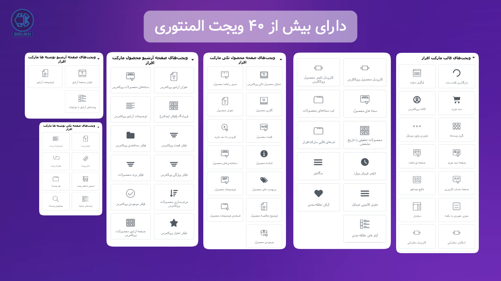

# Marketafraz-theme
# مارکت افراز | قالب فروشگاهی وردپرس (اختصاصی و المنتوری)

## 🎬 تیزر معرفی

> برای تماشا روی تصویر بالا یا [اینجا](https://alisheykhlar.github.io/Marketafraz-theme/) کلیک کنید.

## ✨ ویژگی‌ها
- بیش از ۴۰ ویجت اختصاصی المنتوری
- مگامنو، جستجوی ایجکسی، مینی‌کارت(سبد خرید ایجکسی)، ویش‌لیست و منوهای موبایل، ویجت کاروسل محصولات، اسلایدر، بارگذاری کننده، فیلترها، ویجت های مخصوص طراحی صفحات ووکامرسی و عمومی وردپرس و بسیاری دیگر...
- قالب‌ساز هدر و فوتر، صفحه محصول، صفحه فروشگاه و آرشیو محصولات و صفحات عمومی وردپرس بدون نیاز به المنتور پرو یا افزونه های دیگر
- فیلتر و بارگذاری ایجکسی محصولات ووکامرس آرشیو و بلاگ آرشیوی وردپرس
- طراحی ریسپانسیو برای موبایل و دسکتاپ
- بهنیه شده برای سئو

## 📩 سفارش و اطلاعات بیشتر
سفارش و اطلاعات بیشتر، از طریق:  
- [اینستاگرام دایرکت](https://instagram.com/ali_shk.ir)  
- [تلگرام پشتیبانی مارکت افراز](https://t.me/marketafraz)

## 👨‍💻 طراحی و توسعه
توسط [Ali Sheykhlar](https://github.com/AliSheykhlar)

## 📸 اسکرین‌شات‌ها

  <table>
    <tr>
      <th>صفحه اصلی</th>
      <th>صفحه فروشگاه</th>
      <th>صفحه محصول</th>
    </tr>
    <tr>
      <td></td>
      <td></td>
      <td></td>
    </tr>
  </table>

  <table>
    <tr>
      <th>ویجت‌ها</th>
      <th>ویجت سبد خرید و مگامنو</th>
    </tr>
    <tr>
      <td></td>
      <td></td>
    </tr>
  </table>

